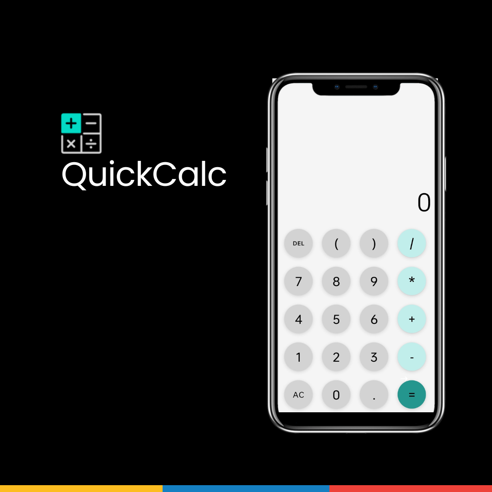

# QuickCalc - A Simple Calculator 

   
Welcome to QuickCalc, a calculator app designed to provide a sleek and efficient calculation experience. This app is open-source and available on GitHub. It is built using Java for Android.


## Features

- **Basic Calculations**: Perform basic arithmetic operations like addition, subtraction, multiplication, and division.
- **Modern UI**: A clean and intuitive user interface designed with modern aesthetics.
- **Responsive Design**: Optimized for various screen sizes and orientations.
- **User-Friendly Interface**: The app has a simple and clean interface with large buttons for easy input.
- **Clear Display**: The app shows the current input or result at the top, making it easy for users to see their calculations.

## Technologies Used


## Screenshots



## Installation

To get started with QuickCalci, you can clone the repository and build the app using Android Studio.

```bash
git clone https://github.com/kunalbandale/QuickCalci.git
```

## How to Use

1. **Launch the App**: Open QuickCalci from your app drawer.
2. **Perform Calculations**: Use the on-screen buttons to enter numbers and operators.

## Contributing

We appreciate contributions from the community! To contribute to the **QuickCalci** project, please follow these guidelines:

1. **Fork the Repository**: Click the "Fork" button at the top right of [this page](https://github.com/kunalbandale/QuickCalc.git).
2. **Clone Your Fork**: Clone the forked repository to your local machine.
   ```bash
   git clone https://github.com/kunalbandale/QuickCalc.git
   ```
3. **Create a Branch**: Create a new branch for your feature or bug fix.
   ```bash
   git checkout -b feature-name
   ```
4. **Make Your Changes**: Implement your feature or bug fix.
5. **Commit Your Changes**: Commit your changes with a clear and descriptive message.
   ```bash
   git commit -m "Add feature name"
   ```
6. **Push to Your Fork**: Push your changes to your forked repository.
   ```bash
   git push origin feature-name
   ```
7. **Create a Pull Request**: Open a pull request to the main repository and describe your changes in detail.

### Contribution Rules

- **Follow the Code of Conduct**: Be respectful and considerate in all interactions.
- **Write Clear Commit Messages**: Ensure your commit messages are descriptive and explain the purpose of the changes.
- **Test Your Changes**: Verify that your changes work as intended and do not break existing functionality.
- **Update Documentation**: If your changes affect documentation or usage, please update it accordingly.
- **Adhere to Coding Standards**: Follow the coding style and guidelines specified in the repository.

Thank you for contributing!

## License

This project is licensed under the MIT License - see the [LICENSE](LICENSE) file for details.


## The Story Behind QuickCalc
When I first ventured into the world of open source, I faced significant challenges. The projects available on platforms like GitHub were often complex and high-end, making it difficult for a beginner like me to contribute effectively. I realized there was a need for simpler projects where individuals could test and improve their skills without feeling overwhelmed.

This realization led me to create QuickCalc. I wanted to develop a project that was both practical and accessible, serving as an entry point for beginners in open-source contributions. A calculator app seemed like the perfect choice—it's a fundamental tool that everyone understands and uses, and it doesn't require advanced programming knowledge to start working on.

QuickCalc isn't just a basic calculator; it's a learning platform. By making this project open source, I aim to provide a space where both beginners and advanced developers can collaborate, make mistakes, learn, and grow together. I believe that open source should be inclusive and supportive, offering opportunities for all skill levels to contribute and improve.

Now, QuickCalc is not only available on the Play Store but also open for contributions on GitHub. I hope this project will inspire others to start their journey in open source, just as it has inspired me to give back to the community that helped me grow.

By opening up QuickCalc to the world, I invite you to join me in this journey of learning and collaboration. Whether you're just starting out or you're an experienced developer, your contributions are valuable and welcome. Let's build something great together.

Thank you for being a part of this journey!

For any inquiries or feedback, please reach out to me at bandalekunal@gmail.com .
